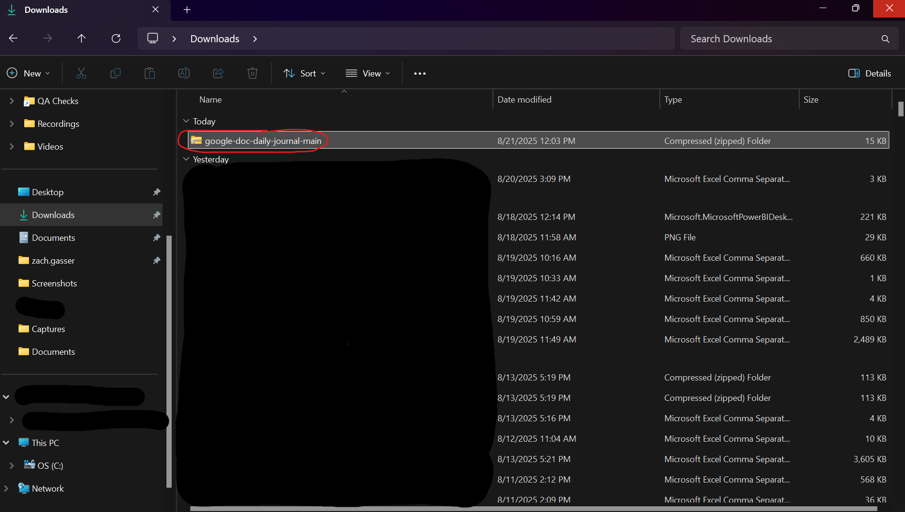

# Google Doc Daily Journal - Chrome Extension
This Chrome extension creates a new Google Doc every day. Each doc is titled the day it was created, and is stored in a folder in your Google Drive called 'Journal'. Use this as your daily journal!

With a [Google One Ai Pro](https://one.google.com/about/google-ai-plans/) subscription ($20/month) you can converse with Gemini about your journal entries!

The following steps walk you through setting up the chrome extension on your machine. You need to do this process every time you want to add this extension to a machine.

## Step 1
Scroll to the top of this page and download zip.

---

## Step 2
Double click downloaded zip folder.

---

## Step 3
Move actual folder somewhere (moving it or deleting it later will break the chrome extension).

---

## Step 4
Go to [chrome://extensions](chrome://extensions).

---

## Step 5
Enable developer mode (1) and click 'Load upacked' (2).

Navigate to the folder you moved in Step 3, select it, then click 'Select Folder'.

---

## Step 6
Copy the id that shows up with your new extension. You'll need it in Step 18.

---

## Step 7
### If you already have a GCP project set up, skip to Step 11.
Go to [Google Cloud Platform](https://cloud.google.com/) and start for free.

---

## Step 8
Put payment info and click 'Start free'. Notice you will not be charged unless you explicitly 'Activate' a full pay-as-you-go account (which we will not be doing).

---

## Step 9
Click 'Agree & Continue'.

---

## Step 10
Click 'close' if you see this popup and click 'Dismiss' on the top alert.

---

## Step 11
Type 'google drive api' in the top search bar in GCP. Click to go to the Google Drive API.

---

## Step 12
Click to enable the Google Drive API.

---

## Step 13
Type 'google auth platform' in the top search bar. Click to go to the Google Auth Platform.

---

## Step 14
Click 'Get started'.

---

## Step 15
Name the app 'Google Doc Daily Journal' and put your email as 'User support email'
Select 'Internal' as audience.
Put your email as the contact email.

---

## Step 16
After finishing the setup you will see this screen. Click 'Create OAuth client'.

---

## Step 17
Select 'Chrome Extension'.

---

## Step 18
Name you OAuth Client 'Google Doc Daily Journal OAuth Client' and paste the ID you got from Step 6 into 'Item ID'.

---

## Step 19
After clicking to finish creating the OAuth Client you will see this screen. Click the copy button to copy the Client ID. You'll need it in Step 22.

---

## Step 20
Go to the location of your chrome extension folder (wherever you moved it in step 3) and open the folder.

---

## Step 21
Edit the 'manifest' file using Notepad.

---

## Step 22
Replace the "\_\_\_ENTER YOUR CLIENT ID HERE\_\_\_" part with the client ID you got in step 19 (make sure you leave the double quotes around the ID).

---

## Step 23
Go back to [chrome://extensions](chrome://extensions) and click the reload button.

---

## You Did It!!
Close your browser and reopen. Chrome will automatically create a folder called 'Journal' in your Google Drive and a Google Doc in the Journal folder titled with today's date. If you close your browser and open it later today, it will continue to open today's Google Doc. When you open Chrome tomorrow it will create a new Google Doc titled with tomorrow's date.
